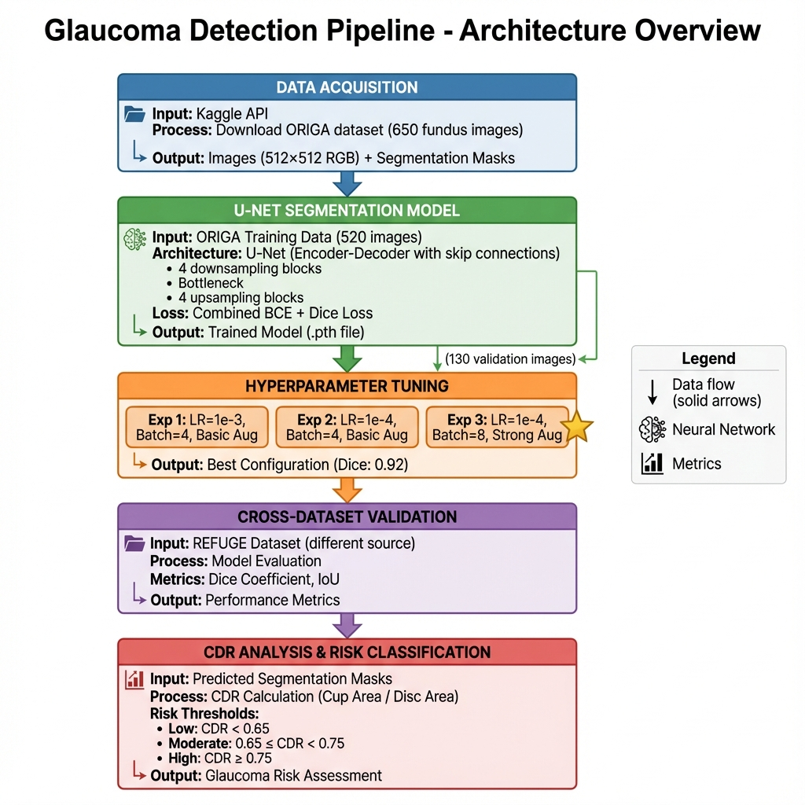

# Glaucoma Detection using Deep Learning

> **A Final Project for the SIC-AI-MISK Program**

A comprehensive deep learning pipeline for automated glaucoma detection through optic disc and cup segmentation in fundus images. This project implements a U-Net architecture for semantic segmentation and calculates the Cup-to-Disc Ratio (CDR) for glaucoma risk assessment.

## 📋 Project Overview

This project addresses automated glaucoma detection using computer vision and deep learning techniques on **retinal fundus images**. It implements a complete pipeline from data acquisition to clinical risk assessment:

- **Task 1**: Dataset acquisition from Kaggle
- **Task 2**: U-Net model training for optic disc/cup segmentation  
- **Task 3**: Hyperparameter tuning experiments
- **Task 4**: Model evaluation on REFUGE dataset
- **Task 5**: CDR calculation and glaucoma risk classification

## 🎯 Key Features

- ✅ Automated optic disc and cup segmentation using U-Net
- ✅ Comprehensive hyperparameter tuning framework
- ✅ Cross-dataset validation (ORIGA → REFUGE)
- ✅ Clinical CDR calculation and risk stratification
- ✅ Extensive visualization and statistical analysis
- ✅ Modular, production-ready Python codebase
- ✅ **Pre-computed results included** for reference

## 📊 Datasets

### ORIGA Dataset (Training)
- **Source**: [Kaggle - Glaucoma Detection](https://www.kaggle.com/datasets/sshikamaru/glaucoma-detection)
- **Images**: 650 fundus images (512×512)
- **Annotations**: Optic disc and cup segmentation masks
- **Usage**: Model training and hyperparameter tuning

### REFUGE Dataset (Testing)
- **Source**: Included in the Kaggle dataset
- **Purpose**: Cross-dataset validation
- **Evaluation**: Dice coefficient, IoU, CDR analysis

## 🛠️ Installation

### Prerequisites
- Python 3.8 or higher
- CUDA-capable GPU (recommended for training)
- Kaggle account (for dataset download)

### Setup

1. **Clone or download this repository**
```bash
cd Final_project
```

2. **Create a virtual environment** (recommended)
```bash
python -m venv venv
# Windows
venv\Scripts\activate
# Linux/Mac
source venv/bin/activate
```

3. **Install dependencies**
```bash
pip install -r requirements.txt
```

4. **Configure Kaggle API** (for dataset download)
   - Create a Kaggle account at https://www.kaggle.com
   - Go to Account → API → Create New API Token
   - Download `kaggle.json` and place it in:
     - **Windows**: `C:\Users\<username>\.kaggle\kaggle.json`
     - **Linux/Mac**: `~/.kaggle/kaggle.json`
   - The dataset will be downloaded from: https://www.kaggle.com/datasets/sshikamaru/glaucoma-detection

## 📁 Project Structure

```
Final_project/
├── src/                          # Source code modules
│   ├── __init__.py              # Package initialization
│   ├── config.py                # Configuration and hyperparameters
│   ├── model.py                 # U-Net architecture and loss functions
│   ├── dataset.py               # Dataset classes and transforms
│   ├── utils.py                 # Utility functions and metrics
│   ├── data_acquisition.py
│   ├── segmentation_model.py
│   ├── hyperparameter_tuning.py
│   ├── refuge_testing.py
│   └── cdr_analysis.py
├── scripts/                      # Executable scripts
│   └── main.py                  # Main runner script
├── docs/                         # Documentation
│   ├── architecture_diagram.png
│   └── PROJECT_STRUCTURE.md
├── results/                      # Output directory (created automatically)
├── models/                       # Saved models (created automatically)
├── data/                         # Dataset location (gitignored)
├── requirements.txt              # Python dependencies
├── .gitignore                   # Git ignore rules
├── README.md                    # This file
├── Group10_Final_Report.docx    # Detailed project report
└── Group10_Presentation.pptx    # Project presentation
```

## 🚀 Usage

### Quick Start - Run All Tasks

To run the complete pipeline (all 5 tasks):

```bash
python scripts/main.py
```

This will:
1. Download the dataset from Kaggle
2. Train the segmentation model
3. Run hyperparameter tuning experiments
4. Evaluate on REFUGE dataset
5. Perform CDR analysis and risk classification

### Run Individual Tasks

You can run specific tasks using the `--task` argument:

```bash
# Task 1: Download dataset
python scripts/main.py --task 1

# Task 2: Train segmentation model
python scripts/main.py --task 2

# Task 3: Hyperparameter tuning
python scripts/main.py --task 3

# Task 4: REFUGE testing
python scripts/main.py --task 4

# Task 5: CDR analysis
python scripts/main.py --task 5
```

### Using Individual Modules

You can also import and use modules programmatically:

```python
from src import segmentation_model
from src import config

# Train a model
model, history = segmentation_model.train_segmentation_model(
    img_dir=config.ORIGA_IMG_DIR,
    mask_dir=config.ORIGA_MASK_DIR,
    num_epochs=20,
    batch_size=4,
    learning_rate=1e-4,
    save_path='models/my_model.pth'
)
```

## 📈 Results

> **For detailed analysis, visualizations, and statistical summaries, see [results/README.md](results/README.md)**

### Segmentation Performance
- **Best Validation Dice**: ~0.92 (Task 3, Experiment 3)
- **Configuration**: LR=1e-4, Batch=8, Strong Augmentation

### REFUGE Cross-Dataset Evaluation
- Dice coefficient and IoU metrics on external test set
- Results saved in `results/task4_refuge_evaluation/`

### CDR Analysis
- Correlation analysis between predicted and ground truth CDR
- Risk classification accuracy with confusion matrix
- Bland-Altman plots and statistical summaries
- Results saved in `results/task5_cdr_analysis/`

## 🏗️ Architecture

The project uses a **U-Net** architecture for semantic segmentation:

- **Encoder**: 4 downsampling blocks with max pooling
- **Bottleneck**: Feature extraction at lowest resolution
- **Decoder**: 4 upsampling blocks with skip connections
- **Output**: Sigmoid activation for binary segmentation
- **Loss Function**: Combined BCE + Dice Loss

### Pipeline Overview



The diagram above shows the complete 5-stage pipeline from data acquisition to clinical risk assessment. See [docs/PROJECT_STRUCTURE.md](docs/PROJECT_STRUCTURE.md) for detailed technical documentation.

## ⚙️ Configuration

Key hyperparameters can be modified in `src/config.py`:

```python
# Training settings
IMG_SIZE = 512
BATCH_SIZE = 4
LEARNING_RATE = 1e-4
NUM_EPOCHS = 20

# CDR thresholds
CDR_THRESHOLD_LOW = 0.5
CDR_THRESHOLD_MODERATE = 0.7
```

## 📊 Output Files

> **Note**: This repository includes pre-computed results from our experiments. See **[results/README.md](results/README.md)** for detailed analysis, visualizations, and key findings.

### Task 2: Training
- `models/unet_origa_512.pth` - Best model weights
- `results/training_history.json` - Training metrics
- `results/training_curves.png` - Loss/Dice plots

### Task 3: Hyperparameter Tuning
- `results/task3_experiments/exp_N/` - Per-experiment results
- `results/task3_experiments/results_table.csv` - Comparison table
- `results/task3_experiments/recommendation.txt` - Best configuration

### Task 4: REFUGE Testing
- `results/task4_refuge_evaluation/test_results.csv`
- `results/task4_refuge_evaluation/test_summary.json`

### Task 5: CDR Analysis
- `results/task5_cdr_analysis/cdr_results.csv` - Detailed CDR values
- `results/task5_cdr_analysis/summary.json` - Statistical summary
- `results/task5_cdr_analysis/*.png` - Visualization plots

## 🤝 Contributors

**Group 10** - SIC-AI-MISK Final Project

This project was developed as part of the **Samsung Innovation Campus (SIC) - AI program** in collaboration with **MISK Foundation**.

### About SIC-AI-MISK

The **Samsung Innovation Campus (SIC) - AI program** in partnership with **MISK Foundation** is an intensive AI education initiative that aims to build Saudi Arabia's artificial intelligence capabilities by training the next generation of AI practitioners and researchers. The program combines theoretical foundations with hands-on project experience in cutting-edge AI and machine learning applications.

**Program Highlights**:
- Advanced training in AI, deep learning, and computer vision
- Real-world capstone projects addressing healthcare and societal challenges
- Collaboration between Samsung Innovation Campus and MISK Foundation
- Focus on practical applications of AI in Saudi Arabia

**This Project**:
- **Program**: Samsung Innovation Campus (SIC) - AI - MISK  
- **Project Type**: Final Capstone Project  
- **Topic**: Automated Glaucoma Detection using Deep Learning
- **Application Domain**: Medical AI and Healthcare

## 📚 References

- **ORIGA Dataset**: Online Retinal Fundus Image Database for Glaucoma Analysis
- **REFUGE Dataset**: Retinal Fundus Glaucoma Challenge
- **U-Net**: Ronneberger et al., "U-Net: Convolutional Networks for Biomedical Image Segmentation" (2015)

## 📄 Additional Documentation

- **Detailed Report**: See `Group10_Final_Report.docx` for comprehensive analysis
- **Presentation**: See `Group10_Presentation.pptx` for project overview
- **Project Structure**: See `docs/PROJECT_STRUCTURE.md` for detailed module descriptions

## 📝 License

This project is created for educational purposes as part of the SIC AI MISK program.

## 🔗 Links

- [Kaggle Dataset](https://www.kaggle.com/datasets/sshikamaru/glaucoma-detection)
- [Project Documentation](./docs/)
