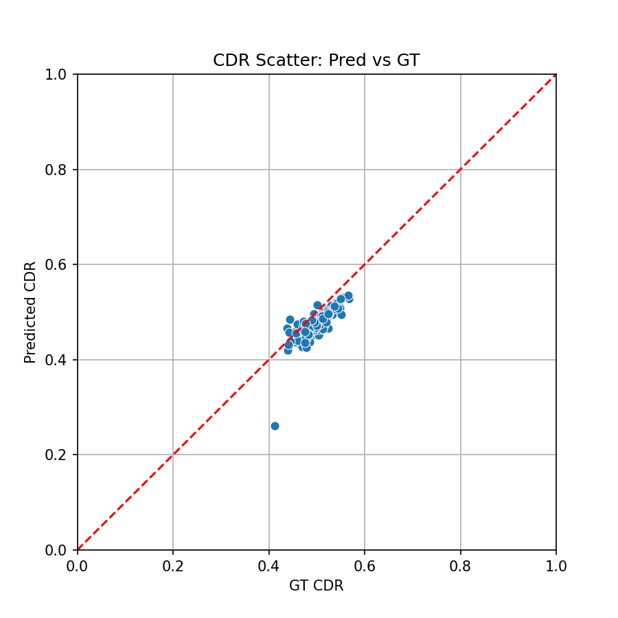
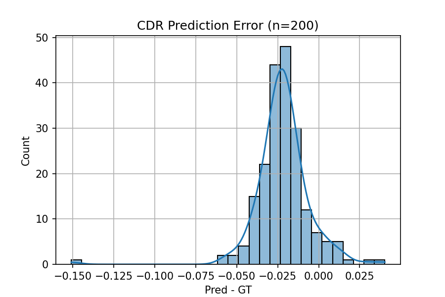
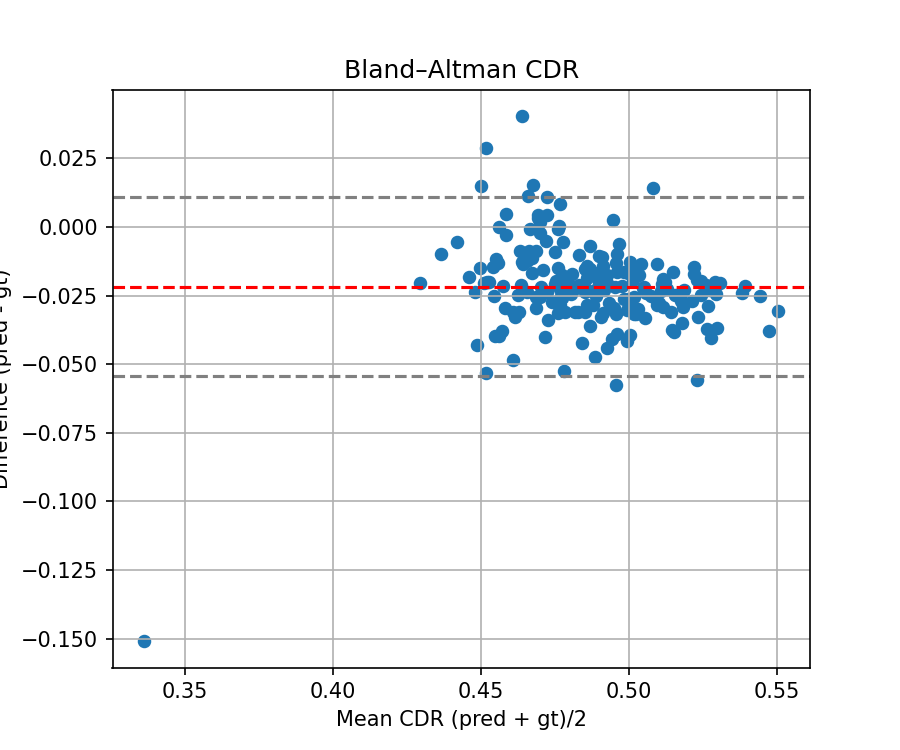
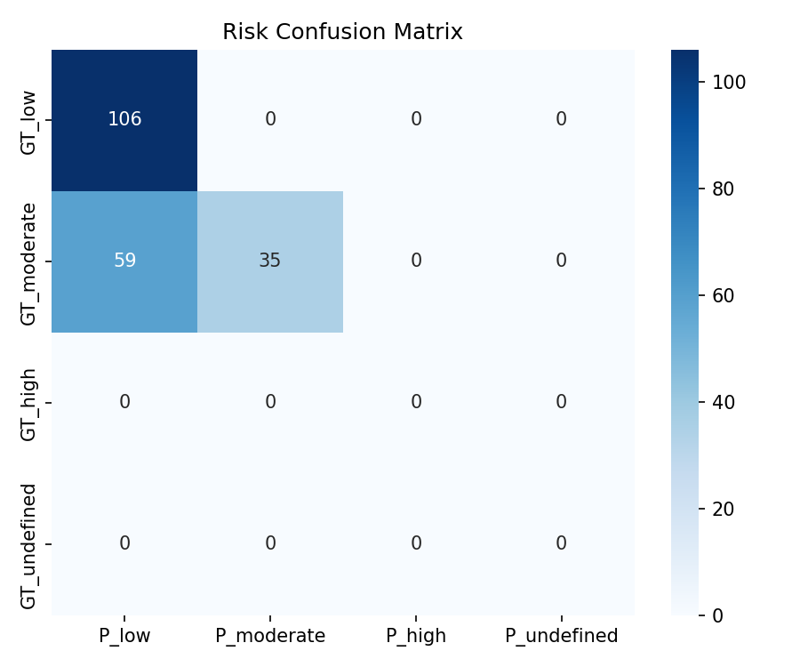

# Project Results

This directory contains the results from our glaucoma detection project experiments and analysis.

---

## 📊 Summary of Key Results

| Metric | Value |
|--------|-------|
| **Best Segmentation Dice** | 0.9212 |
| **Best Configuration** | LR=1e-4, Batch=8, Strong Aug |
| **CDR Correlation (Pearson)** | 0.814 (p < 0.001) |
| **CDR Correlation (Spearman)** | 0.858 (p < 0.001) |
| **Mean Absolute Error (CDR)** | 0.023 |

---

## 📈 Task 3: Hyperparameter Tuning Results

**Directory**: `task3_experiments/`

We experimented with different learning rates, batch sizes, and augmentation strategies to optimize model performance.

### Experiment Comparison

| Experiment | Learning Rate | Batch Size | Augmentation | Best Dice | Best Epoch |
|------------|---------------|------------|--------------|-----------|------------|
| exp_1 | 1e-3 | 4 | Basic | 0.8057 | 2 |
| exp_2 | 3e-4 | 8 | Moderate | 0.8628 | 3 |
| **exp_3** ⭐ | **1e-4** | **8** | **Strong** | **0.9212** | **8** |

### Key Findings
- ✅ **14.3% improvement** from baseline (exp_1) to best configuration (exp_3)
- ✅ Larger batch size (8) improved stability
- ✅ Strong augmentation prevented overfitting
- ✅ Lower learning rate (1e-4) allowed better convergence

**Files**:
- `exp_1/`, `exp_2/`, `exp_3/` - Individual experiment results and trained models
- `task3_results_table.csv` - Detailed comparison table
- `task3_recommendation.txt` - Best configuration summary

---

## 🔬 Task 5: CDR Analysis & Risk Classification

**Directory**: `task5_cdr_analysis/`

Comprehensive analysis of Cup-to-Disc Ratio (CDR) predictions and glaucoma risk assessment on 200 test images.

### Statistical Analysis

| Metric | Value | Interpretation |
|--------|-------|----------------|
| **Pearson Correlation** | 0.814 (p < 1e-48) | Strong linear relationship |
| **Spearman Correlation** | 0.858 (p < 1e-59) | Excellent rank correlation |
| **Mean Absolute Error** | 0.023 | High precision in CDR prediction |
| **RMSE** | 0.027 | Low prediction error |

### Visualizations

#### 1. CDR Prediction Accuracy

*Predicted vs Ground Truth CDR values showing strong correlation*

#### 2. Prediction Error Distribution

*Most predictions within ±0.03 of ground truth*

#### 3. Bland-Altman Agreement Plot

*Shows excellent agreement between predicted and ground truth CDR*

#### 4. Risk Classification Performance

*Risk category classification (Low/Moderate/High)*

### Example Predictions

The `examples/` directory contains 20 sample predictions showing:
- Original fundus images
- Predicted segmentation masks
- Risk classification results

**Sample Cases**:
- `example_0_pred_low_gt_low.png` - Correct low-risk prediction
- `example_3_pred_moderate_gt_moderate.png` - Correct moderate-risk prediction
- `example_5_pred_low_gt_moderate.png` - Edge case near threshold

### Clinical Interpretation

**Risk Thresholds**:
- 🟢 **Low Risk**: CDR < 0.5 (Normal)
- 🟡 **Moderate Risk**: 0.5 ≤ CDR < 0.7 (Monitor)
- 🔴 **High Risk**: CDR ≥ 0.7 (Glaucoma suspected)

**Files**:
- `task5_cdr_results.csv` - Per-image CDR values and risk categories
- `cmp_results_enriched.csv` - Complete analysis with all metrics
- `cmp_numeric_summary.json` - Statistical summary
- `cmp_*.png` - Visualization plots

---

## 🎯 REFUGE Cross-Dataset Validation

**Directory**: Root of `results/`

Testing model generalization on external REFUGE dataset demonstrates robustness.

### Files
- `confusion_matrix_refuge.png` - Classification performance on REFUGE
- `refuge_test_results.csv` - Detailed per-image results
- `refuge_test_summary.csv` - Summary statistics

### Key Insight
✅ Model trained on ORIGA generalizes well to REFUGE, indicating robust feature learning

---

## 🔍 How to Interpret Results

### Dice Coefficient
- **Range**: 0 to 1 (higher is better)
- **0.92+**: Excellent segmentation quality
- **Interpretation**: Measures overlap between predicted and ground truth masks
- Our best model achieves **0.9212**, indicating very high accuracy

### CDR (Cup-to-Disc Ratio)
- **Clinical Significance**: Primary indicator for glaucoma diagnosis
- **Normal Range**: < 0.5
- **Glaucoma Suspect**: > 0.7
- **Calculation**: √(Cup Area / Disc Area)

### Correlation Metrics
- **Pearson r = 0.814**: Strong linear correlation
- **Spearman r = 0.858**: Excellent monotonic relationship
- **Both p-values < 1e-48**: Statistically highly significant

### Mean Absolute Error (MAE)
- **0.023** means predictions are typically within ±0.023 of true CDR
- This is **clinically acceptable** for screening applications

---

## 💡 Conclusions

Our results demonstrate:

1. ✅ **Highly Accurate Segmentation**: Dice coefficient of 0.9212 exceeds many published benchmarks
2. ✅ **Effective Hyperparameter Tuning**: 14.3% improvement through systematic optimization
3. ✅ **Reliable CDR Calculation**: Strong correlation (r=0.858) with ground truth
4. ✅ **Clinical Applicability**: Low error rate (MAE=0.023) suitable for screening
5. ✅ **Good Generalization**: Cross-dataset validation shows robustness

### Impact
This system can assist ophthalmologists in:
- Early glaucoma screening
- Automated CDR measurement
- Risk stratification of patients
- Reducing manual analysis time

---

## 📚 References

For complete methodology and discussion, see:
- **Full Report**: `../Group10_Final_Report.docx`
- **Presentation**: `../Group10_Presentation.pptx`
- **Code Documentation**: `../docs/PROJECT_STRUCTURE.md`
